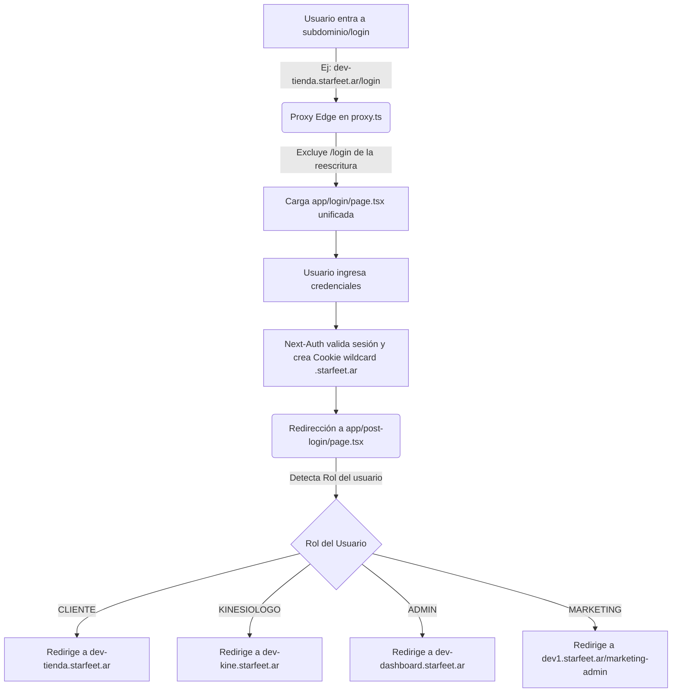

# Análisis de la Arquitectura de Autenticación y Login

Este documento presenta una auditoría técnica del sistema de autenticación de la plataforma **Starfeet**, detallando cómo funciona el sistema de login unificado para todos los subdominios de la aplicación.

---

## 🔍 Respuesta Rápida

**No**, cada subdominio de la plataforma no tiene una página de login físicamente independiente en el código. En su lugar, Starfeet implementa una **arquitectura de login centralizada** y unificada de tipo **Single Sign-On (SSO)**.

Aunque el usuario acceda desde distintas URLs (como `dev-tienda.starfeet.ar/login` o `dev-dashboard.starfeet.ar/login`), todas estas peticiones son atendidas internamente por la misma página y lógica del servidor Next.js.

---

## 🗺️ Mapa de Flujo y Funcionamiento

A continuación se detalla cómo interactúan las piezas del sistema de autenticación:



---

## 🛠️ Detalle de Componentes Técnicos

### 1. El Proxy Edge (`proxy.ts` / Middleware)
El archivo `proxy.ts` intercepta todas las peticiones entrantes. Para los subdominios (`tienda.`, `kine.`, `dashboard.`), reescribe las rutas hacia sus respectivas carpetas internas en App Router (`/tienda`, `/kinesio`, `/admin`).

Sin embargo, posee una **exclusión explícita** para las rutas de autenticación:
```typescript
// proxy.ts
if (
  pathname.startsWith("/_next") ||
  pathname.startsWith("/api") ||
  pathname.startsWith("/images") ||
  pathname.startsWith("/login") || // <--- EXCLUIDO
  pathname.startsWith("/registro") || // <--- EXCLUIDO
  pathname.startsWith("/recuperar") || // <--- EXCLUIDO
  pathname.startsWith("/post-login") || // <--- EXCLUIDO
  pathname.includes(".")
) {
  return NextResponse.next(); // No reescribe, se sirve la ruta global centralizada
}
```

### 2. Compartición de Sesión (Cookies Wildcard)
Next-Auth está configurado en `auth.ts` para emitir cookies con dominio base compartido (`.starfeet.ar`):
```typescript
// auth.ts
cookies: {
    sessionToken: {
        name: sessionCookieName,
        options: {
            httpOnly: true,
            sameSite: "lax",
            path: "/",
            secure: useSecureCookies,
            domain: useSecureCookies ? baseDomain : undefined, // Ej: ".starfeet.ar"
        },
    },
}
```
Esto permite que, una vez que el usuario se autentica en la ruta unificada `/login` bajo cualquier subdominio, el navegador guarde la cookie para todo el dominio `.starfeet.ar` y sus subdominios, logrando una sesión fluida.

### 3. Redirección Post-Login por Roles
El archivo `lib/role-redirect.ts` es el cerebro que decide a dónde enviar al usuario según su rol después de una autenticación exitosa:
* **`ADMIN`** ➔ `dev-dashboard.starfeet.ar` (Panel de Administración)
* **`KINESIOLOGO`** ➔ `dev-kine.starfeet.ar` (Panel de Kinesiología)
* **`CLIENTE`** ➔ `dev-tienda.starfeet.ar` (Tienda/Catálogo)
* **`MARKETING`** ➔ `dev1.starfeet.ar/marketing-admin` (Panel de Marketing)

---

## ⚖️ Ventajas y Desventajas del Modelo Centralizado

### ✅ Ventajas
1. **Mantenibilidad Excelente**: Existe un solo formulario de login (`LoginForm.tsx`) y una sola página (`app/login/page.tsx`). Si mañana agregas login por Apple o modificas las reglas de contraseña, se actualiza en un solo lugar.
2. **Sesión Única (SSO)**: Si un administrador inicia sesión en la tienda y luego navega al dashboard, no tiene que volver a ingresar sus credenciales; el sistema lo reconoce de inmediato.
3. **Optimización de Código**: Evita la duplicación innecesaria de componentes pesados y esquemas de validación Zod.

### ⚠️ Desventajas / Puntos a Tener en Cuenta
* **Personalización Visual Limitada**: Al ser una sola página, por defecto el login se ve exactamente igual para un Cliente, un Kinesiólogo o un Administrador. 
  * *Solución (Si se requiere)*: Se puede leer la cabecera `Host` o los parámetros de URL en el servidor para cambiar ligeramente el título, logo o colores según el subdominio desde el cual se accede.

---

## 🔧 Propuesta de Refinamiento: Ocultar Navbar en Login Global

Actualmente en `app/layout.tsx`, el componente `Navbar` del Home se oculta basándose en `isPlatform` (si la URL contiene subdominios de plataforma):
```typescript
// app/layout.tsx
const isPlatform = 
  host.includes("kine.") || 
  host.includes("dashboard.") || 
  host.includes("tienda.");
```
Si un usuario entra a `/login` desde el dominio o subdominio principal de la landing (`dev1.starfeet.ar/login`), `isPlatform` es **falso**, por lo que se renderiza el `Navbar` del Home sobre la tarjeta limpia de `AuthShell`.

### Cambio Sugerido
Podemos actualizar el componente `Navbar.tsx` para que detecte si el pathname es `/login`, `/registro` o `/recuperar` y se oculte de forma definitiva, eliminando cualquier ruido visual o parpadeo.
