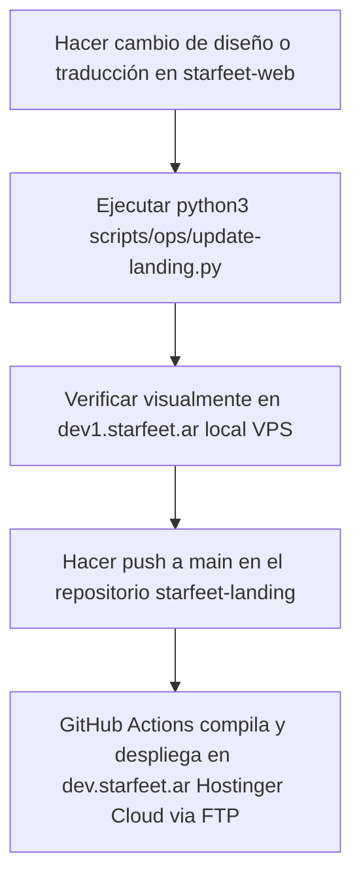

# Flujo de Trabajo y Arquitectura: Landing vs. Web Core

Este documento explica cómo está construido el ecosistema de Starfeet, la relación entre los repositorios `/starfeet-web` y `/starfeet-landing`, y cómo gestionar el flujo de cambios en desarrollo y producción.

---

## 1. ¿Por qué existen dos repositorios/carpetas?

El ecosistema está segregado en dos proyectos independientes para optimizar el rendimiento, el SEO y la seguridad:

| Específica | `starfeet-landing` (Landing) | `starfeet-web` (Core / VPS) |
| :--- | :--- | :--- |
| **Entornos y Dominios** | `https://dev1.starfeet.ar` (VPS - Desarrollo local)<br>`https://dev.starfeet.ar` (Hostinger Cloud - Staging/QA) | `https://tienda.starfeet.ar` (VPS - Checkout)<br>`https://kine.starfeet.ar` (VPS - Kinesiólogos)<br>`https://dashboard.starfeet.ar` (VPS - Admin) |
| **Servidor / Hosting** | **Hostinger Cloud** (para `dev.starfeet.ar`) / **VPS** (para `dev1.starfeet.ar`) | **VPS (Docker / Traefik)** |
| **Base de Datos** | MySQL (Hostinger) para textos dinámicos | PostgreSQL (Local VPS) para transacciones y usuarios |
| **Rol Principal** | Presentación visual, marca, testimonios y captación de leads. | Catálogo dinámico, checkout, pagos, perfiles de kinesiólogos/clientes/admin y base transaccional. |

> [!NOTE]
> **Planificación de Dominio Futuro**: Una vez finalizado el desarrollo, se tiene planeado migrar el dominio de producción `starfeet.ar` al nuevo dominio definitivo: **`starfeetoficial.com`**.

---

## 2. El Flujo de Sincronización (¿Por qué están duplicados algunos archivos?)

Para mantener consistencia estética (Tailwind CSS, fuentes, animaciones, i18n), **el diseño maestro se desarrolla y valida en `starfeet-web`** (dentro del VPS). 

Cuando modificas componentes visuales o traducciones base, se debe usar el script de sincronización para propagarlos al proyecto de la landing.

### Archivos sincronizados por el script `update-landing.py`:
*   **Traducciones**: `/messages/es.json`
*   **Utilidades i18n**: `/lib/i18n.ts`
*   **Componentes de la Landing**:
    *   `ProductStages.tsx` (Etapas)
    *   `CuandoPisasBien.tsx` (Parallax banner)
    *   `UnerValidation.tsx` (Comprobación científica de la UNER)
    *   `HealthSolution.tsx` (Soluciones de salud)
    *   `Footer.tsx` (Pie de página)
*   **Recursos públicos**: Vídeos de etapas, logotipos (`logo_SF.svg`, etc.) y **modelos 3D (`public/models/*`)**.

---

## 3. Entorno de Desarrollo y Visualización (`dev1.starfeet.ar` vs `dev.starfeet.ar`)

*   **`dev1.starfeet.ar` (VPS)**: Es el contenedor local de la landing (`starfeet-landing`) levantado por Docker Compose en tu VPS de desarrollo. Sirve para **verificar visualmente los cambios de inmediato** tras correr el script de sincronización.
*   **`dev.starfeet.ar` (Hostinger Cloud)**: Es el entorno de staging alojado en Hostinger Cloud.
    *   **Despliegue Automático**: Cuando haces `push` a la rama `main` en el repositorio `starfeet-landing`, un flujo de GitHub Actions (`.github/workflows/deploy.yml`) compila el sitio de forma estática y lo sube automáticamente mediante **FTP Deploy** a Hostinger, impactando en `dev.starfeet.ar`.

Esto permite que:
*   Pruebes la maquetación de inmediato en `dev1.starfeet.ar` en tu VPS.
*   Valides el despliegue integrado y la respuesta del servidor en `dev.starfeet.ar` antes de que el desarrollo esté listo para producción.

---

## 4. Guía rápida para hacer cambios



### Pasos para actualizar:
1.  Edita los archivos de componentes dentro de `/opt/docker/starfeet-web`.
2.  Ejecuta la sincronización en la terminal del VPS para copiar a la carpeta local de la landing:
    ```bash
    python3 scripts/ops/update-landing.py
    ```
3.  Verifica los cambios visuales locales en `https://dev1.starfeet.ar/`.
4.  Cuando estés conforme, haz push a la rama `main` de `starfeet-landing` para desplegar en `https://dev.starfeet.ar/`.


